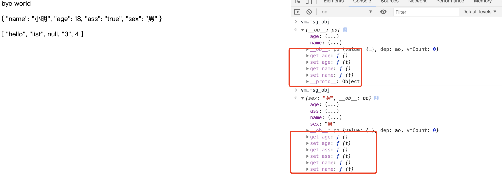

## 2.08 实例 data属性


##### 1. 数据属性

vue的数据是写在 vue实例(选项)对象的data属性中，通过Mustache模板语法(双大括号)，把数据插入到页面    

```
<div id="app">
    {{ msg1 }} 
    {{ msg2 }} 
</div>
<script>
    let vm = new Vue({
      el:'#app',
      data:{
        msg1:'hello msg1',
        msg2:["hello","msg2"],
      }
    })
</script>


特点：     
1. js 输出数组时，会显示[object object]，而 vue 会直接输出 json 编码后的值
2. 调试时将内容渲染到页面，比将数据输出到控制台更加有效果
3. 页面会随着值得变化而变化(响应式)
```

##### 2. 普通数据响应式
```
为什么值改变页面会发生变化？
1、vue 实例化时，data 对象中的所有属性就会加入到 vue 的响应系统 
2、get/set 方法就是 vue 响应系统的函数方法
3、get/set 方法就会一直监听该数据，并根据值的变化做出响应，改变视图

4、data 对象中初始化的对象才能被响应，新加的数据不能 (建议即使不使用也初始化进去)
5、Object.freeze() 是冻结方法，即不允许修改对象的属性值，也不会触发响应系统
```

##### 3. 对象数据响应式
```
1、实例化 vue 之前，定义好的对象以及对象中的属性都会被响应系统监听
2、新增的对象属性不会被检测响应

如何让新增的对象属性被监听？
1、使用 vm.$set(vm.msg_obj, "sex", "男")【量多的时候不好】
2、直接替换整个对象 vm.msg_obj={name: "aaa", txt: "txt"}【对象中属性很多时太麻烦】
3、采用对象的方法添加 vm.msg_obj = Object.assign({}, vm.msg_obj, {ass: "true"}) 

```

##### 4. 数组数据响应式
测试过程，感觉新版本的 vue 不是用以下方法也可以监听到 list 变动

```
数组渲染到页面，虽然可以更改数组的内容，但是无法触发vue响应系统 

如何让数组的属性被监听？
变异方法(即更改原数组)
push()
pop()
shift()
unshift()
splice()
sort()
reverse()

非变异方法(即不会更改原数组)
filter()
concat()
slice()

```


##### 5. 示例
 


```
<html lang="en">
<head>
    <meta charset="UTF-8">
    <meta name="viewport" content="width=device-width, initial-scale=1.0">
    <title>Document</title>
</head>
<body>
    <script src="https://cdn.staticfile.org/vue/2.2.2/vue.min.js"></script>
    <div id="app">
        <p>{{ msg }}</p> 
        <p>{{ msg_obj }}</p> 
        <p>{{ msg_list }}</p> 
    </div>
    
    <script>
        var freeze_msg = {foo: 'bar'}
        Object.freeze(freeze_msg)
        let vm = new Vue({
          el:'#app',
          data:{
            msg: 'hello msg1',
            msg_obj: {name:'jack', age: 18},
            msg_list: ["hello","list"],
            msg_freeze: freeze_msg,
          }
        })

        setTimeout(() => {
            vm.$data.msg = "bye world" 
            vm.msg_obj.name = "小明";
            vm.msg_obj = Object.assign({}, vm.msg_obj, {ass: "true"}) //会加入到响应系统
            vm.msg_obj.sex = "男"   // 不会加入到响应系统, 在assign前边就会引入进去
            vm.msg_list[3] = "3" 
            vm.msg_list.push(4)           
        }, 5000)

    </script>
</body>
</html>

```
