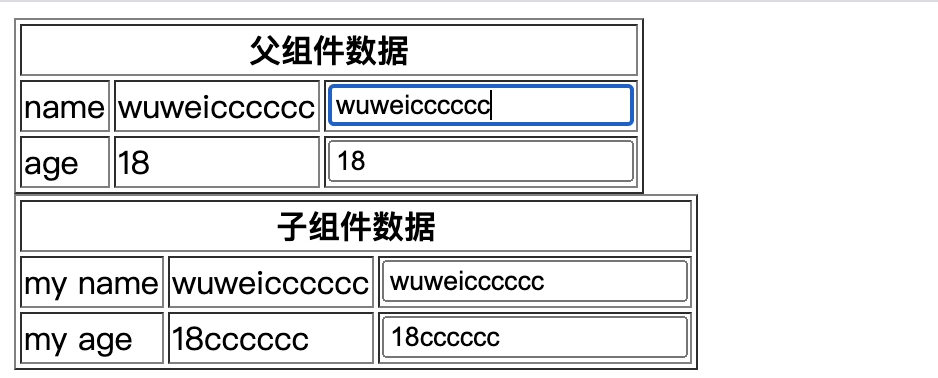

## 2.12 组件 子组件传参props

##### 1. 父子组件的嵌套
组件实例的作用域是孤立的。意味着不能再子组件的模板内直接引用父组件数据。


```
<body>
    <script src="https://cdn.staticfile.org/vue/2.2.2/vue.min.js"></script>

    <div id="app">
       <my-component></my-component>
    </div>
    <template id="MyComponent">
        <div>
            <h3>我是父组件 {{msg}}</h3>
            <my-son></my-son>
            <my-son :Mymsg="msg" /> <!-- 传递给 子组件中的 prop -->
        </div>
    </template>
    <template id="son">
        <span>我是子组件 {{Mymsg}}</span>
    </template>

    <script>
        let sonComponent = {
            template:`#son`,
            props: ["Mymsg"],   // 父template中传递的Mymsg变量
        }
    
        let MyComponent = {
            template: `#MyComponent`,
            data() {
                return {
                    msg: "(父组件数据)"
                }
            },
            components: {
                mySon: sonComponent
            }, 
        }
       
        const vm = new Vue({
            el:"#app",
            components: {
                "MyComponent": MyComponent
            }
        })
    </script>
</body>
```
    

##### 2. props 的使用
```
1、子组件如何使用父组件的数据？
子组件如果想使用父组件中的数据，需要父组件将数据绑定到子组件的自定义标签上。           
子组件在选项中添加一个 props 属性接收数据             


2、为什么传递过程中要使用v-bind指令？
不使用v-bind，传递给子组件的永远是字符串，使用的话会根据表达式传递任何类型数据，也是静态和动态传输的区别

3、传递数据类型的影响
传递基本类型的数据，父子作用域独立，更改互相不影响
传递引用类型的数据(如对象数据)，数据内存地址固定，更改互相影响

4、父子组件数据更新时触发的改变？
会触发单向下行数据流，即如下：
父组件数据更新时，传递给子组件的prop也会更新
子组件数据更新时，父组件不会有变化 (基本数据类型报错，引用类型数据报错，直接修改属性不报错，但不建议)

子组件不能(也不要)改变父组件传递过来的值，否则会报错。

5、prop 响应式
通过上面说法及下面例子，父组件数据发生变化，子组件也会发生变化，
即给子组件prop传递的数据发生变化，子组件使用prop的地方就会发生变化

6、那我们如何改变子组件的数据呢？
把父组件传递过来的值，赋值给自己的数据，就可以更改了
一：修改基本数据
props: ['count'],
data(){
  return {
    num: this.count
  }
}
二：修改引用数据
props:['bb'],
// 在自己的data数据中浅拷贝一份父组件传过来的引用数据
data(){
    return {
        cc: JSON.parse(JSON.stringify(this.bb))
    }
}

7、props 特性？
父组件通过属性传值，子组件有对应的props接受，那么这个属性不会出现在网页的标签上

```


```
<body>
    <script src="https://cdn.staticfile.org/vue/2.2.2/vue.min.js"></script>

    <div id="app">
        <!-- 使用组件 -->
        <my-component></my-component>
    </div>
    
    <!-- 子组件模板 -->
    <template id="son">
        <table border="1">
            <tr>
                <th  colspan="3">子组件数据</th>
            </tr>
            <tr>
                <td>my name</td>
                <td>{{ myName }}</td>
                <td>
                    <input type="text" v-model="myName">
                </td>
            </tr>
            <tr>
                <td>my age</td>
                <td>{{ myAge }}</td>
                <td>
                    <input type="text" v-model="myAge">
                </td>
            </tr>
        </table>
    </template>
    
    <!-- 父组件模板 -->
    <template id="MyComponent">
        <div>
            <table border="1">
                <tr>
                    <th  colspan="3">父组件数据</th>
                </tr>
                <tr>
                    <td>name</td>
                    <td>{{ name }}</td>
                    <td>
                        <input type="text" v-model="name">
                    </td>
                </tr>
                <tr>
                    <td>age</td>
                    <td>{{ age }}</td>
                    <td>
                        <input type="text" v-model="age">
                    </td>
                </tr>
            </table>
            <!-- 通过两个组件的契合点，父组件通过自定义属性将数据传递给子组件 -->
            <!-- 在属性传输数据的时候使用连字符语法 -->
            <my-son :my-name="name" :my-age="age"></my-son>
        </div>
    </template>
    
    <script>
        // 子组件选项
        let sonComponent = {
            // 子组件通过props接受数据并使用
            // 数组里放父组件中自定义属性的名字
            // props 里面使用驼峰写法
            props:["myName","myAge"],
            template:`#son`,
        }
    
    
        //  父组件选项对象
        let MyComponent = {
            template: `#MyComponent`,
            data(){
                return {
                    name:"wuwei",
                    age:18
                }
            },
            // 将子组件定义为父组件的局部组件
            components: {
                mySon: sonComponent
            }
        }
    
        //  实例中注册组件
        const vm = new Vue({
            el:"#app",
    
            components: {
                "MyComponent": MyComponent
            }
    
        })
    
    </script>
</body>
```

##### 3. props 验证

我们可以为组件的 prop 指定验证规则，验证父组件传入的数据符不符合要求。                
验证规则需要用对象形式，不能用字符串或者数组。                

```
1、验证数据类型

2、验证多个数据类型

3、指定必须要传入的数据

4、指定默认值 (基础类型或引用类型的默认值)

5、自定义验证规则

props 会在组件实例创建之前进行校验，
所以default或者validator函数里，data、methods、computed实例属性还都不能用


props:{
    myName:String,
    myType: [Number,String,Boolean,Function,Object,Array,Symbol], //所有数据类型
    myAge: {
        type: Number,    // type为验证数据类型
        required: true,  // required为数据是否必须传递,true是false 否
        default: 20,    // 默认值 基础类型
        //default: function(){ return []}  // 默认类型 引用类型
        validator:function(value){    //   自定义验证器
            return value > 16        // 返回true 验证通过, 返回false 验证不通过报错
        }
    }
},

```


验证父组件传递的数据类型

允许数据传递多种数据类型

type类型有哪些

必须传递的数据

指定默认值

自定义验证规则


