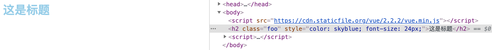
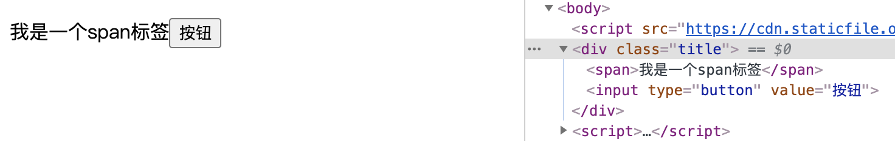

## 2.18 组合 模板render


##### 1. 基本了解
```
Render函数是vue2.x新增的一个函数，主要用于提升节点性能，它是基于javascript计算。
使用Render函数将template里面的节点解析成虚拟的Dom。

定义：
vue推荐绝大多数情况使用template创建html，然而一些场景真的需要js的完全编程能力，就要用render，它更接近编译器。

原理：
vue框架的核心就是虚拟DOM，编译template时需要转译成vnode函数，当reder函数构建DOM时，vue就免去了转译的步骤。

render基本了解：
可以将一个函数传递给vue实例选项对象中的render属性，该函数接收一个createElement函数。
可以使用它指定需要在页面上显示的内容，creatElement就是一个用来创建虚拟DOM(vnode)的函数

```

##### 2. createElement 
```
<script>
    const vm = new Vue({
        el: "#app",
        render:function(createElement){
            return createElement("input", 
            {
               'class': {
                    foo: true,
                    bar: false
                },
                style: {
                    color: 'skyblue',
                    fontSize: '24px'
                }
            },
            "这是标题")
        }
    })
</script>
```


1、render方法：        
第一个参数必填，类型是function(createElement)           
返回值是vnode(虚拟节点)，类型是string、array               

2、createElement函数：             
第一个参数：页面上显示的标签元素(必填){String | Object | Function}               
第二个参数：包含配置信息的数据对象(比如html特性、属性、事件侦听器等) {Object}          
第三个参数：一个子节点字符串或者数组 {String | Array}             


第二个参数：        
注意：class/style并没有在attrs属性中，是因为v-bind指令的特性，如果仅将他们当做attrs中一个属性，就不能将他们设置为数组或者对象         
```
{
  // 与 `v-bind:class` 的 API 相同，
  // 接受一个字符串、对象或字符串和对象组成的数组
  'class': {
    foo: true,
    bar: false
  },
  // 与 `v-bind:style` 的 API 相同，
  // 接受一个字符串、对象，或对象组成的数组
  style: {
    color: 'red',
    fontSize: '14px'
  },
  // 普通的 HTML attribute
  attrs: {
    id: 'foo'
  },
  // 组件 prop
  props: {
    myProp: 'bar'
  },
  // DOM property
  domProps: {
    innerHTML: 'baz'
  },
  // 事件监听器在 `on` 内，
  // 但不再支持如 `v-on:keyup.enter` 这样的修饰器。
  // 需要在处理函数中手动检查 keyCode。
  on: {
    click: this.clickHandler
  },
  // 仅用于组件，用于监听原生事件，而不是组件内部使用
  // `vm.$emit` 触发的事件。
  nativeOn: {
    click: this.nativeClickHandler
  },
  // 自定义指令。注意，你无法对 `binding` 中的 `oldValue`
  // 赋值，因为 Vue 已经自动为你进行了同步。
  directives: [
    {
      name: 'my-custom-directive',
      value: '2',
      expression: '1 + 1',
      arg: 'foo',
      modifiers: {
        bar: true
      }
    }
  ],
  // 作用域插槽的格式为
  // { name: props => VNode | Array<VNode> }
  scopedSlots: {
    default: props => createElement('span', props.text)
  },
  // 如果组件是其它组件的子组件，需为插槽指定名称
  slot: 'name-of-slot',
  // 其它特殊顶层 property
  key: 'myKey',
  ref: 'myRef',
  // 如果你在渲染函数中给多个元素都应用了相同的 ref 名，
  // 那么 `$refs.myRef` 会变成一个数组。
  refInFor: true
}

//  class style的不同写法
{
    class:["class1",{"class2":true}]，
    style: {background: red}
}
```

##### 3. 简写
每次写createElement都很繁琐，所以我们可以用别名h        

(以及用数组的方式插入多个标签)
```
<div id="app"></div>

<script>
    const vm = new Vue({
        el: "#app",
        render(h){
            return h("div", 
            {
                class:"title"
            },
            [
                h("span","我是一个span标签"),
                h("input",{
                    attrs:{
                        type:"button",
                        value:"按钮"
                    }
                })
            ])
        }
    })
</script>
```


##### 4. 约束

组件树中所有虚拟DOM(VNode)必须是唯一的。


```
<body>
    <script src="https://cdn.staticfile.org/vue/2.2.2/vue.min.js"></script> 
    
    <div id="app">
    </div>
    
    <div id="app2">
    </div>
    
    <script>
        // 可以实现，也没报错，但是不合法，因为虚拟DOM不唯一
        const vm = new Vue({
            el:"#app",
            data:{
                msg:'hello'
            },
            render(h){
                // 1. 创建虚拟DOM 节点
                let myVNode = h("p","hello");
                // 2. 返回最终的虚拟DOM
                return h("div",[
                    myVNode,myVNode,myVNode,myVNode
                ])
            }
        })

        // 建议使用map方法创建多个虚拟DOM，并且都唯一
        const vm2 = new Vue({
            el:"#app2",
            data:{
                msg:'hello2'
            },
            render(h){
                return h("div",
                         Array.apply(null,{length:4}).map(() => {
                            return h("p","hello2")
                        })
                 )
            }
        })
    </script>
</body>
```
