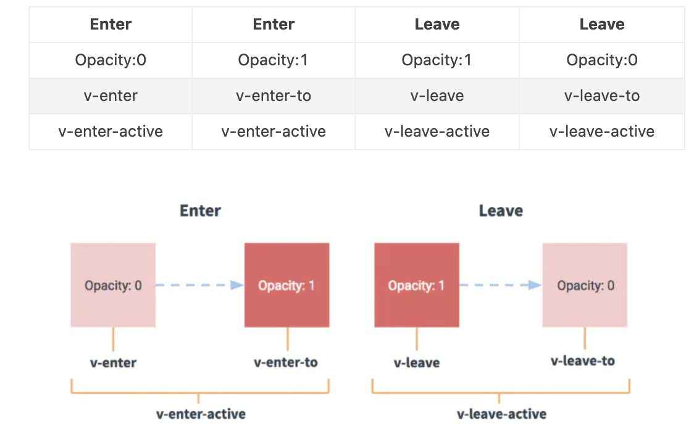

## 2.19 过渡动画 transition

vue 提供了 transition 的封装组件，来处理过渡及动画

##### 1. 简介

```
1、前言
vue插入。更新、移除DOM时，提供多种不同方式的应用过度效果，包括以下工具：
在css过渡和动画中自动应用css
配合使用三方css动画库，如Animate.css
在过渡钩子函数中使用Javascript直接操作DOM
可以配合使用第三方JavaScript动画库，如Velocity.js

2、使用场景
在条件渲染中(v-if)
在条件展示中(v-show)
在动态组件中
在组件的根节点中

3、使用说明
只有在DOM的隐藏到显示，显示到隐藏，才能使用过渡或动画
动画的元素需要被 vue 提供的组件 transition 包裹
在插入或删除 transition 包裹元素时，vue会在恰当的实际中添加或删除类名
如果过渡的组件提供了Javascript钩子函数，则vue会在恰当的时机调用它
如果没有找到javascript钩子函数，并且也没检测到css过渡/动画，则在下一帧执行

```

##### 2. css 过渡


```
vue 动画/过渡分为两个过程，进入和离开。中间有6个class的切换

1. v-enter：过渡开始的状态，元素被插入之前生效，被插入之后下一帧移除
2. v-enter-active: 过渡生效时状态。元素被插入之前生效，在过渡/动画完成后移除
3. v-enter-to: 2.1.8版及以上过渡结束状态。在元素被插入下一帧生效，动画/过渡完成后移除

4. v-leave: 定义离开过渡的开始状态。离开过渡被触发时立刻生效，下一帧被移除
5. v-leave-active: 离开过渡生效时状态。离开过渡时被触发，过渡/动画完成后移除。
6. v-leave-to: 2.1.8版及以上离开过渡的结束状态。离开过渡下一帧生效，在过渡/动画完成后移除 

过渡前缀：
1. 默认 transition 不指定 name，则 v- 便是那些类名的默认前缀
2. 如果 transition 指定了 <transition name="myname">，则 v-enter 会替换为 myname-enter

在过渡中也可以使用贝塞尔曲线
```

示例：设置元素不显示时即为leave状态，切换为显示时即为enter状态
```
<body>
    <script src="https://cdn.staticfile.org/vue/2.2.2/vue.min.js"></script> 
    
    <style>
        div{
            font-size:30px;
            font-weight: bold;
        }
        .v-enter{
            color:red;
        }
        .v-enter-to{
            color:blue;
        }
        .v-enter-active{
            transition:all 5s;
        }
        .v-leave{
            color: yellow;
        }
        .v-leave-to{
            color: purple;
        }
        .v-leave-active{
            transition:all 5s;
        }
    </style>
    
    
    <div id="app">
        <!-- 按钮,点击切换元素的显示和隐藏 -->
        <button @click="isShow = !isShow">点击切换 isShow={{ isShow }}</button>
    
        <!-- 显示元素 -->
        <transition>
            <div v-if="isShow">需要过渡的元素</div>
        </transition>
    
    </div>
    
    
    <script>
    
        //  实例
        const vm = new Vue({
            el:"#app",
            data:{
                isShow:true
            }
        })
    </script>
</body>
```

##### 3. css 动画
我们可以在Vue中使用过渡 transition,还可以使用动画 animation
```
<body>
    <script src="https://cdn.staticfile.org/vue/2.2.2/vue.min.js"></script> 
    
    <style>
        div{
            font-size:30px;
            font-weight: bold;
        }
        @keyframes fade-in{
            0%{
                transform: scale(0);
            }
            50%{
                transform: scale(1.5);
            }
            100%{
                transform: scale(1);
            }
        }
        .fade-enter-to{
            color: red;
        }
        .fade-enter-active{
            animation: fade-in 5s linear;
        }
    
        .fade-leave{
            color: yellow;
        }
        .fade-leave-active{
            animation: fade-in 5s linear reverse;
        }
    
    </style>
    
    
    
    <div id="app">
        <!-- 按钮,点击切换元素的显示和隐藏 -->
        <button @click="isShow = !isShow">点击切换isShow={{ isShow }}</button>
    
        <!-- 显示元素 -->
        <transition name="fade">
            <div v-if="isShow">需要动画的元素</div>
        </transition>
    
    </div>
    
    
    <script>
    
        const vm = new Vue({
            el:"#app",
            data:{
                isShow:true
            }
        })
    </script>
</body>
```

##### 4. 自定义过渡动画的类名
```
我们可以通过以下 attribute 自定义过渡类名：(优先级高于普通类名，结合三方库十分有用)      
enter-class 
enter-active-class 
enter-to-class (2.1.8+)

leave-class
leave-active-class
leave-to-class (2.1.8+)

比如: 
<style>
    .enter{
        transform-origin:left center;
        animation: fade-in 3s linear;
    }
</style>
<div id="app">
    <!-- 显示元素 -->
    <transition 
            name="fade"
            enter-active-class="enter"
            leave-active-class="leave"
            >
        <div v-if="isShow">需要动画的元素</div>
    </transition>
</div>
```


##### 5. js 动画过渡
vue 中的 js 动画是通过 vue 提供给的动画钩子函数来绑定事件，然后再事件函数中处理对应的动画。
```
1. 动画入场的钩子函数
before-enter 动画入场运动前一刻执行
enter 动画运动时执行
after-enter 动画运行完毕并调用回调done时执行


2. 动画出场的钩子函数
before-leave 动画出场运动前一刻执行
leave 动画出场时执行
after-leave 动画出场完毕时执行

3. 注意
使用js过渡时，enter和leave中必须使用done进行回调，否则过渡会立即完成。
仅使用js过渡元素添加 v-bind:css="false"，vue会跳过css检测，避免过程中css影响
js 动画没有动画时长，我们可以借助 velocity.js 处理动画

```

##### 6. 动画插件库
css参考：<https://github.com/animate-css/animate.css>
```
<html lang="en">
<head>
    <meta charset="UTF-8">
    <meta name="viewport" content="width=device-width, initial-scale=1.0">
    <title>txt</title>
    <link href="https://cdn.jsdelivr.net/npm/animate.css@3.5.1" rel="stylesheet" type="text/css">
</head>
<body>
    <script src="https://cdn.staticfile.org/vue/2.2.2/vue.min.js"></script> 
    <style>
        .fade-enter,
        .fade-leave-to{
          opacity:0;
        }
        .fade-enter-active,
        .fade-leave-active{
          transition: opacity 3s
        }
      </style>
      <div id="app">
        <transition
                    name="fade"
                    appear
                    enter-active-class="animated swing fade-enter-active"
                    leave-active-class="animated flipInX fade-leave-active"
                    appear-active-class="animated swing"
                    >
          <div v-show="show">Hello wold</div>
        </transition>
    <script>
        const vm = new Vue({
            el:"#app",
            data:{
                show:true
            }
        })
    </script>
</body>
</html>
```

js参考：<https://github.com/shepherdwind/velocity.js>

```
<div id="app">
  <transition
              name="fade"
              @before-enter="handleBeforeEnter"
              @enter="handleEnter"
              @after-enter="handleAfterEnter"
              >
    <div v-show="show">Hello wold</div>
  </transition>
  <button @click="handleChange">点击</button>
</div>
<script src="./vue.js"></script>
<script>
  var app = new Vue({
    el:'#app',
    data:{
      show: true
    },
    methods:{
      handleChange(){
        this.show= !this.show
      },
      handleBeforeEnter(el){

        el.style.opacity=0  // 动画开始样式
      },
      handleEnter(el,done){


        Velocity(el,{
          opacity: 1   // 动画结束后的样式
        },{
          duration: 2000,  // 动画运行的时间
          complete: done   // 动画运动完成后执行的函数
        })

      },
      handleAfterEnter(el){
        el.style.fontSize="50px"
      }
    }
  })
</script>
```


##### 7. 多个元素之间的过渡
多元素过渡就是利用 v-if/v-show等切换元素的显示，显示的就是入场动画，隐藏的就是出场动画。           

注意：             
1、动画内部相同标签名元素切换时，只改内容没有动画效果，因为vue的dom复用机制(为了提升效率)          
2、key属性用来阻止dom元素复用，在v-for的时候已经介绍过了           
3、mode="in-out/out-in" 表示先进后出/先出后进，不写则同时进出
```
<body>
    <script src="https://cdn.staticfile.org/vue/2.2.2/vue.min.js"></script> 
    <style>
        div{
            font-size:30px;
            font-weight: bold;
            opacity:1;
        }
        .fade-enter,.fade-leave-to{
            opacity: 0;
        }
        .fade-enter-active,.fade-leave-active{
            transition:all 3s;
        }
    </style>
    
    <div id="app">
        <!-- 按钮,点击切换元素的显示和隐藏 -->
        <button @click="isShow = !isShow">点击切换</button>
    
        <!-- 显示元素 -->
        <transition name="fade" mode="in-out">
            <div v-if="isShow" key="hello">Hello wold</div>
            <div v-else key="bye">Bye wold</div>
        </transition>
    </div>
    
    <script>
        const vm = new Vue({
            el:"#app",
            data:{
                isShow: true
            }
        })
    </script>
</body>
```

##### 8. 多个组件之间的过渡
```
<style>
    .fade-enter,.fade-leave-to{
        opacity:0
    }
    .fade-enter-active,.fade-leave-active{
        transition: opacity 1s;
    }
</style>
<div id="app">
    <transition name="fade" mode="out-in">
        <component :is="type"></component> 
    </transition>
    <button @click="handleChange">点击切换</button>
</div>

<script>
    Vue.component("child",{
        template:"<div>chile</div>"
    })
    Vue.component("child-one",{
        template:"<div>chile-on</div>"
    })

    var app = new Vue({
        el:'#app',
        data:{
            type: "child"
        },
        methods:{
            handleChange(){
                this.type = this.type == "child"?"child-one":"child"
            }
        }
    })
</script>
```
以上是利用动态组件切换组件，不使用动态组件的写法如下：
```
<transition name="fade" mode="out-in">
        <child v-if="show"></child>
        <child-one v-else></child-one>
</transition>
data:{
    show: true
},
methods:{
    handleChange(){
        this.show= !this.show
    }
}
```

##### 9. 列表过渡
之前我们讲了单个节点过渡、同一时间渲染多个节点中的一个过渡，那怎么同时渲染整个列表呢？         

vue中的列表过渡使用的是transition-group标签嵌套 
原理：        
transition-group 就是给列表中每个元素循环套上了tarnsition标签。       
注意：          
for 循环key尽量不要用index值，会降低性能，项目功能上也会造成一定影响。

```
<style>
    .fade-enter,.fade-leave-to{
        opacity:0
    }
    .fade-enter-active,.fade-leave-active{
        transition: opacity 1s;
    }
</style>
<div id="app">
    <transition-group name="fade">
        <div v-for="item in list" :key="item.id">
            {{item.title}}
        </div>
    </transition-group>

    <button @click="handleChange">点击新增</button>
</div>

<script>

    var app = new Vue({
        el:'#app',
        data:{
            count: 0,
            list: []
        },
        methods:{
            handleChange(){
                this.list.push({
                    id: this.count++,
                    title: "Hello World"
                })
            }
        }
    })
</script>
```


##### 10. 可复用的过渡-封装vue动画

利用组件和slot的方式,将动画封装成一个组件,这样可以通过组件调用发方式复用相同动画

```
<style>
    .box{
        font-size:30px;
        font-weight:bold;
    }
    .fade-enter,.fade-leave-to{
        opacity:0
    }
    .fade-enter-active,.fade-leave-active{
        transition: all 3s
    }
</style>

<div id="app">
    <button @click="handleChange">点击切换</button>
    <fade :show="show" name="fade">
        <div class="box">Hello wold</div>
    </fade>
</div>

<!-- 组件模板 -->
<template id="myTransition">
    <transition 
                :name="name"
                >
        <slot v-if="show"></slot>
    </transition>
</template>

<script>
    // 定义全局组件
    Vue.component("fade",{
        props:["show","name"],
        template:`#myTransition`,
    })
    
    // Vue 实例
    const vm = new Vue({
        el:'#app',
        data:{
            show: true
        },
        methods:{
            handleChange(){
                this.show= !this.show
            }
        }
    })
</script>
```

