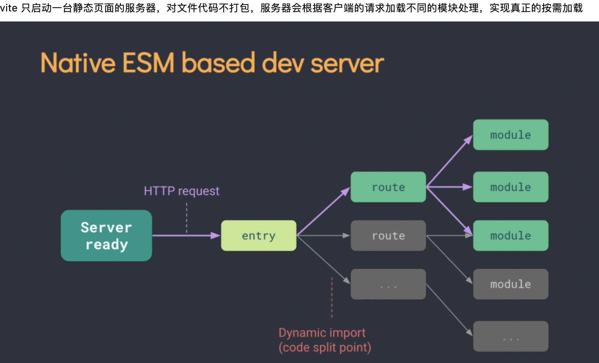

## 4.01 构建: vite

#### 1. 简介
官方：<https://cn.vitejs.dev/guide/>   
```
vite 下一代前端开发和构建工具

1. 极速服务启动，原生esm文件无需打包
2. 轻量快速的热重载
3. 丰富的功能, typescript、jsx、css支持开箱即用
4. 优化的构建，可选多页应用或库的预配置rollup构建
5. 通用的插件，在开发和构建之间共享rollup-superset插件接口
6. 完全类型化的API，灵活的api和typescript


背景：
最初配合vue3.0一起使用的，后来适配了各种前端项目，目前提供vue、react、preact等框架模板
vue 使用 vue-cli 脚手架，react 使用create-react-app 脚手架，虽然脚手架不同，但是内部都是webpack
为什么要开发一个全新的构建工具？
新的东西诞生，首先要确定是为了解决什么问题？
1. 快速冷启动
2. 即时热重载
3. 按需编译
```




#### 2. 基本使用
```
# Vite 需要 Node.js 版本 >= 12.0.0。

$ npx vite --help

# 搭建 vite 三种方式
$ npm init vite@latest
$ yarn create vite
$ pnpx create-vite

# 构建 vite + vue 项目
# npm 6.x
$ npm init vite@latest my-vue-app --template vue
# npm 7+, 需要额外的双横线：
$ npm init vite@latest my-vue-app -- --template vue
# yarn
$ yarn create vite my-vue-app --template vue


```

#### 3. 配置
<http://blog.51weblove.com/397.html>    
<https://cn.vitejs.dev/config>    
```

```