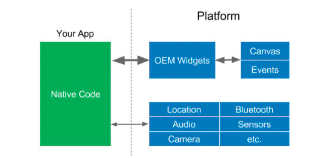
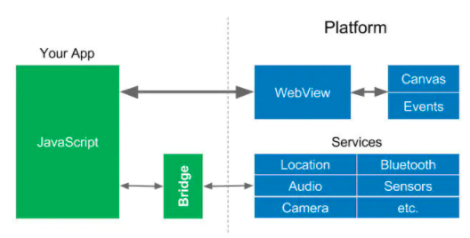
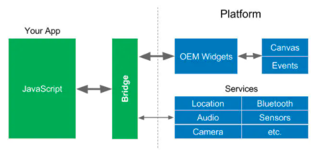
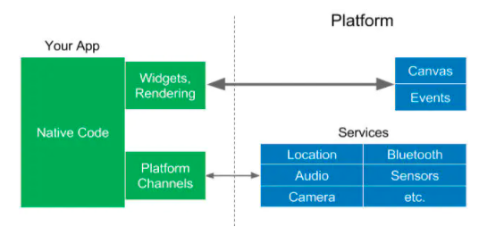

## 1.01 跨平台解决方案

```
背景：
苹果2008发布IOS，google2009发布android。
他们SDK基于两种不同的语言Object-c 和 java，+ swift 和 kotiln

但是小公司没有这门多端的开发，就衍生了很多跨平台解决方案
```



参考：<https://www.jianshu.com/p/51e989500ca3>

#### 1. webview + js

webview 是什么？
Webview 是一个基于 webkit 的引擎，可以解析 DOM 元素，展示 html 页面的控件，它和浏览器展示页面的原理是相同的，所以可以把它当做浏览器看待。

原理：  
UI 通过 webview 来显示 html 代码  
系统服务通过一个中间层桥接到 javascript



#### 2. React native

facebook 2015 年开源的跨平台应用开发框架，react 框架上的衍生物。  
支持 IOS、安卓两大平台。

原理：RN 不仅桥接系统服务，也将 ui 桥接到了 js 中  
缺点：因为 UI 渲染频繁，桥接要花一定的时间，所以会有些性能问题  


#### 3. Flutter

谷歌开源的 UI 工具，帮助开发者通过一套代码库构建多平台精美应用  
支持移动、web、桌面、嵌入式平台

原理：  
Dart 语言开发，Dart 可被编译成(AOT) 成不同平台的本地代码，让 flutter 直接和平台通信，而不需要桥接过程，从而提高了性能。



#### 4. uni-app

使用 vue.js 开发所有前端应用的框架，一套代码，可快速部署到各个平台及小程序。

原理：
