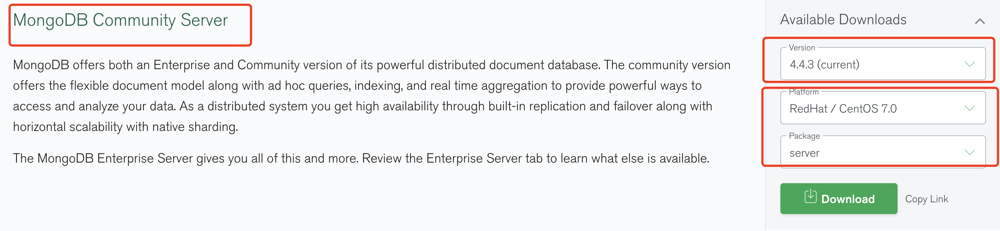

## 4.12 模块 mongodb

Mongodb 是一种文档导向数据库, 也是非关系型数据库(nosql)，c++编写。     


##### 1. 服务器安装 mongodb
<https://www.mongodb.com/try/download/community>         
实验建议下载server包，tgz包需要自己建日志数据目录启动文件等。     


       
```
1. 安装服务端
wget https://repo.mongodb.org/yum/redhat/7/mongodb-org/4.4/x86_64/RPMS/mongodb-org-server-4.4.3-1.el7.x86_64.rpm

rpm -ivh mongodb-org-server-4.4.3-1.el7.x86_64.rpm
rpm -ql mongodb-org-server

systemctl start  mongod.service 
systemctl enable mongod.service

ss -anptl|grep mongo    // 已启动127.0.0.1:27017, 配置文件 /etc/mongod.conf

2. 安装shell客户端
wget  https://fastdl.mongodb.org/linux/mongodb-shell-linux-x86_64-rhel70-4.4.3.tgz
tar zxvf mongodb-shell-linux-x86_64-rhel70-4.4.3.tgz
mv mongodb-linux-x86_64-rhel70-4.4.3 mongodb-4.4.3
export PATH=/data/mongodb-4.4.3/bin/:$PATH
which mongo   // /data/mongodb-4.4.3/bin/mongo
mongo    // 连接进入mongo

3. 基础概念
database	   数据库
collection	数据库表/集合
document	   数据记录行/文档
field	      数据字段/域
index	      索引
joins	 	   表连接,MongoDB不支持
primary key	主键,MongoDB自动将_id字段设置为主键


4. 基础操作CURD
db        // 查看所在的数据库
use txt   //创建并切换到txt数据库
show dbs  // 查看所有数据库，没有数据的数据库不显示
show tables     // 查看集合
show collection // 查看集合
db.col.find().pretty()  // 查看数据

// 创建固定集合，空间大小6142800KB，文档最大个数10000个
db.createCollection("col1", {capped: true, autoIndexId: true, size: 6142800, max: 10000})


db.txt.insert({"name": "txt", title: 'MongoDB 教程'})  // 插入一条数据，不存在集合会自动创建

db.col.update({'title':'MongoDB 教程'},{$set:{'title':'MongoDB'}})  // 更新

db.dropDatabse()  // 删除当前数据库
db.txt.drop()     // 删除集合
db.col.remove({'title':'MongoDB 教程'})    // 删除数据


```


##### 2. nodejs 连接 mongodb
```
1. 安装 nodejs 客户端
npm install mongodb

2. 共用变量
var MongoClient = require('mongodb').MongoClient;
var url = "mongodb://localhost:27017/runoob";

3. 连接(创建) runoob 数据库，创建 site 集合
MongoClient.connect(url, function(err, db) {
   if (err) throw err;
   console.log("数据库已创建!");

   var dbase = db.db("runoob");
   dbase.createCollection('site', function (err, res) {
        if (err) throw err;
        console.log("创建集合!");
        db.close();
   });

  db.close();
});

4. 插入多条数据
    var dbo = db.db("runoob");
    var myobj =  [
        { name: '菜鸟工具', url: 'https://c.runoob.com', type: 'cn'},
        { name: 'Google', url: 'https://www.google.com', type: 'en'},
        { name: 'Facebook', url: 'https://www.google.com', type: 'en'}
       ];
    dbo.collection("site").insertMany(myobj, function(err, res) {
        if (err) throw err;
        console.log("插入的文档数量为: " + res.insertedCount);
        db.close();
    });
// 插入单条
dbo.collection("site").insertOne({name: "菜鸟教程", url: "runoob"}, function(err, res) {}


5. 查询数据
    var dbo = db.db("runoob");
    dbo.collection("site"). find({}).toArray(function(err, result) { // 返回集合中所有数据
        if (err) throw err;
        console.log(result);
        db.close();
    });

// 指定查找
dbo.collection("site"). find({"name":'菜鸟教程'}).toArray(function(err, result) {}
// 排序，type 1 = 按 type 字段升序，type = 0 按type字段降序
dbo.collection("site").find().sort({type: 1}).toArray(function(err, result){}  
// 分页
dbo.collection("site").find().limit(2).toArray(function(err, result) {}
// 跳过指定
dbo.collection("site").find().skip(2).limit(2).toArray(function(err, result) {}

6. 更新数据
    var dbo = db.db("runoob");
    var whereStr = {"name":'菜鸟教程'};  // 查询条件
    var updateStr = {$set: { "url" : "https://www.runoob.com" }};
    dbo.collection("site").updateOne(whereStr, updateStr, function(err, res) {
        if (err) throw err;
        console.log("文档更新成功");
        db.close();
    });

// 更新所有符合条件的，只需要把updateOne 换成 updateMany 即可

7. 删除数据
    var dbo = db.db("runoob");
    var whereStr = {"name":'菜鸟教程'};  // 查询条件
    dbo.collection("site").deleteOne(whereStr, function(err, obj) {
        if (err) throw err;
        console.log("文档删除成功");
        db.close();
    });

8. 删除test集合
    var dbo = db.db("runoob");
    dbo.collection("test").drop(function(err, delOK) {  // 执行成功 delOK 返回 true，否则返回 false
        if (err) throw err;
        if (delOK) console.log("集合已删除");
        db.close();
    });

```

##### 3. 使用promise和异步函数
```
const MongoClient = require("mongodb").MongoClient;
const url = "mongodb://localhost/";
MongoClient.connect(url).then((conn) => {
    console.log("数据库已连接");
    const test = conn.db("testdb").collection("test");
    // 增加
    test.insertOne({ "site": "runoob.com" }).then((res) => {
        // 查询
        return test.find().toArray().then((arr) => {
            console.log(arr);
        });
    }).then(() => {
        // 更改
        return test.updateMany({ "site": "runoob.com" },
            { $set: { "site": "example.com" } });
    }).then((res) => {
        // 查询
        return test.find().toArray().then((arr) => {
            console.log(arr);
        });
    }).then(() => {
        // 删除
        return test.deleteMany({ "site": "example.com" });
    }).then((res) => {
        // 查询
        return test.find().toArray().then((arr) => {
            console.log(arr);
        });
    }).catch((err) => {
        console.log("数据操作失败" + err.message);
    }).finally(() => {
        conn.close();
    });
}).catch((err) => {
    console.log("数据库连接失败");
});

-------------------------
const MongoClient = require("mongodb").MongoClient;
const url = "mongodb://localhost/";
 
async function dataOperate() {
    var conn = null;
    try {
        conn = await MongoClient.connect(url);
        console.log("数据库已连接");
        const test = conn.db("testdb").collection("test");
        // 增加
        await test.insertOne({ "site": "runoob.com" });
        // 查询
        var arr = await test.find().toArray();
        console.log(arr);
        // 更改
        await test.updateMany({ "site": "runoob.com" },
            { $set: { "site": "example.com" } });
        // 查询
        arr = await test.find().toArray();
        console.log(arr);
        // 删除
        await test.deleteMany({ "site": "example.com" });
        // 查询
        arr = await test.find().toArray();
        console.log(arr);
    } catch (err) {
        console.log("错误：" + err.message);
    } finally {
        if (conn != null) conn.close();
    }
}
 
dataOperate();

------------------------------
>>>
数据库已连接
[ { _id: 5f169006a2780f0cd4ea640b, site: 'runoob.com' } ]
[ { _id: 5f169006a2780f0cd4ea640b, site: 'example.com' } ]
[]
```