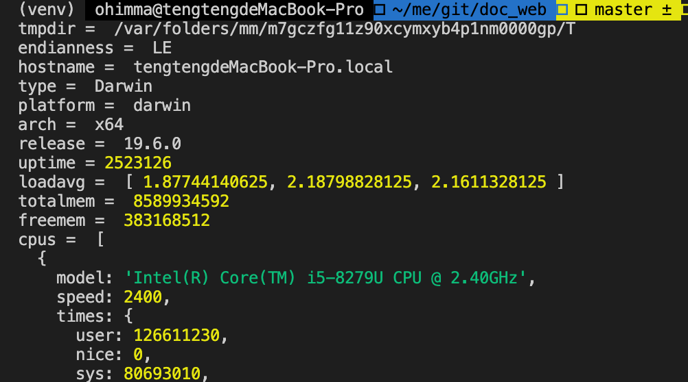

## 4.01 模块 os

提供基本的系统操作函数。         

参考：<https://nodejs.org/api/os.html>   

```
os.tmpdir()         返回操作系统的默认临时文件夹。
os.endianness()     返回 CPU 的字节序，可能的是 "BE" 或 "LE"。
os.hostname()       返回操作系统的主机名。
os.type()           返回操作系统名
os.platform()       返回编译时的操作系统名
os.arch()           返回操作系统 CPU 架构，可能的值有 "x64"、"arm" 和 "ia32"。
os.release()        返回操作系统的发行版本。
os.uptime()         返回操作系统运行的时间，以秒为单位。
os.loadavg()        返回一个包含 1、5、15 分钟平均负载的数组。
os.totalmem()       返回系统内存总量，单位为字节。
os.freemem()        返回操作系统空闲内存量，单位是字节。
os.cpus()           返回一个对象数组，包含每个CPU/内核的信息：型号、速度、时间
os.networkInterfaces()   获得网络接口列表。

```

```
var os = require("os");
console.log("tmpdir = ", os.tmpdir())         
console.log("endianness = ", os.endianness())     
console.log("hostname = ", os.hostname())       
console.log("type = ", os.type())       
console.log("platform = ", os.platform())       
console.log("arch = ", os.arch())          
console.log("release = ", os.release())        
console.log("uptime =", os.uptime())         
console.log("loadavg = ", os.loadavg())        
console.log("totalmem = ", os.totalmem())       
console.log("freemem = ", os.freemem())        
console.log("cpus = ", os.cpus())           
console.log("networkInterfaces =", os.networkInterfaces())

```
